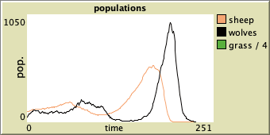
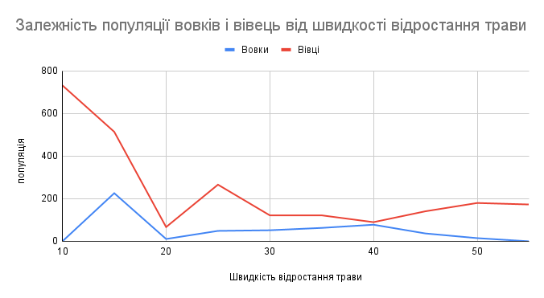

## Комп'ютерні системи імітаційного моделювання
## СПм-22-4, **Жовтоніжко Дмитро Сергійович**
### Лабораторна робота №**2**. Редагування імітаційних моделей у середовищі NetLogo

 

### Варіант 7, модель у середовищі NetLogo:
[Wolf Sheep Predation](http://www.netlogoweb.org/launch#http://www.netlogoweb.org/assets/modelslib/Sample%20Models/Biology/Wolf%20Sheep%20Predation.nlogo)

 

### Внесені зміни у вихідну логіку моделі, за варіантом:

**Виправлення розміщення активних агентів**

Прибрати "зграйність" вовків - тепер перед початком свого ходу вовки повинні "оглядатися", перевіряючи оточення, та обирати напрямок руху виходячи з наявності вівець та відсутності інших вовків. Якщо немає іншої можливості – переміщається випадково. При знаходженні на одній ділянці поля двох вовків залишається лише один з них. Вівці переміщаються випадковим чином, але при виявленні вовка на одній із клітин поруч змінюють напрямок на протилежний.

Завдання полягає у тому, щоб змінити алгоритм, за яким роблять ходи вовки та вівці.
Ходять вони процедурою move, яка є спільною для вовків та овець

<pre>
to move  ; turtle procedure
  rt random 50
  lt random 50
  fd 1
end
</pre>

Розділимо цю процедуру на дві, одну для вовків
<pre>
to move-wolve  ; wolf procedure
  ; wolves "look around" before moving
  let potential-prey wolves-on neighbors with [any? sheep-here]
  
  ; if there's prey nearby, choose the direction towards prey
  ifelse any? potential-prey [
    let target one-of potential-prey
    face target
    move-to target  ; move directly towards the target
  ] 
   [
    ; try finding a free patch once
    let free-patch? false
    rt random 50
    lt random 50
    if not any? wolves-here [
      set free-patch? true
    ]
    
    ; if a free patch is found, move forward; otherwise, move randomly
    ifelse free-patch? [
      fd 1
    ] [
      rt random 50
      lt random 50
      fd 1
    ]
  ]
end
</pre>

І одну для овець
<pre>
to move-sheep  ; sheep procedure
  ; sheep move randomly
  rt random 50
  lt random 50
  fd 1
  
  ; if there's a wolf nearby, change direction
  let nearby-wolves wolves-on neighbors
  if any? nearby-wolves [ 
    set heading heading + 180  ; change direction
  ]
end
</pre>

У програмі ми їх також викликаємо кремо 
<pre>
 ask sheep [
    move-sheep
</pre>

<pre>
  ask wolves [
    move-wolve
</pre>

Тепер вівці переміщаються випадковим чином, але при виявленні вовка на одній із клітин поруч змінюють напрямок на протилежний.
Вовки переміщаються до вівці, якщо на клітинці є вовк, то тоді агент шукає іншу клітинку, поки не знайде, куди йому піти, де немає іншого вовка. Інакше, робить випадковий крок.

Фінальний код моделі та її інтерфейс доступні тут [Wolf Sheep Predation.nlogo]

## Обчислювальні експерименти

Подивимось, як вплинули зміни на рост популяції вовків та овець;

### 1. Вплив швидкості відростання трави на популяцію вовків та овець
Досліджується залежність розміру популяції вовків та овець протягом певної від швидкості відростання трави. Заміри відбуваються після того, як у моделі пройшло 500 тактів.
Усього було проведено 10 ексеперементів
Інші керуючі параметри мають значення за замовчуванням:
- **initial-number-of-sheeps** 100.
- **initial-number-of-wolves** 50.
- **sheep-gain-from-food** 4.
- **wolf-gain-from-food** 20.
- **sheep-reproduce** 4.
- **wolf-reproduce** 4.

<table>
<thead>
<tr><th>Кількість вівець</th><th>Кількість вовків</th><th>Швидкість відростання трави</th></tr>
</thead>
<tbody>
<tr><td>732</td><td>0 </td><td>10</td></tr>
<tr><td>514</td><td>226</td><td>15</td></tr>
<tr><td>67</td><td>11</td><td>20</td></tr>
<tr><td>266</td><td>49</td><td>25</td></tr>
<tr><td>122</td><td>52</td><td>30</td></tr>
<tr><td>122</td><td>63</td><td>35</td></tr>
<tr><td>90</td><td>78</td><td>40</td></tr>
<tr><td>141</td><td>37 </td><td>45</td></tr>
<tr><td>180</td><td>15 </td><td>50</td></tr>
<tr><td>173</td><td>0 </td><td>55</td></tr>

</tbody></td>
</table>

Графік демонструє, що більш оптимальна модель переміщення вовків збільшує їх популяцію, порівняно з результатами, отриманими у ЛР1. 
