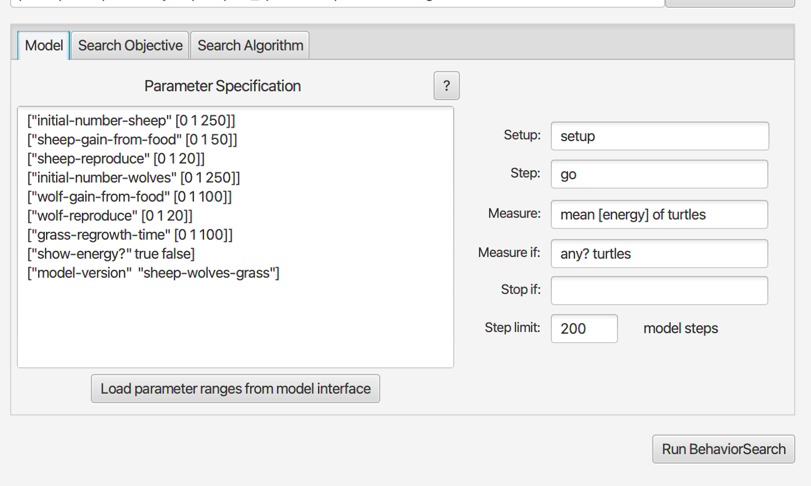
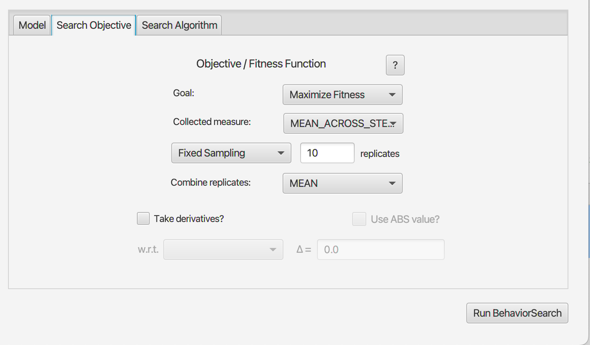
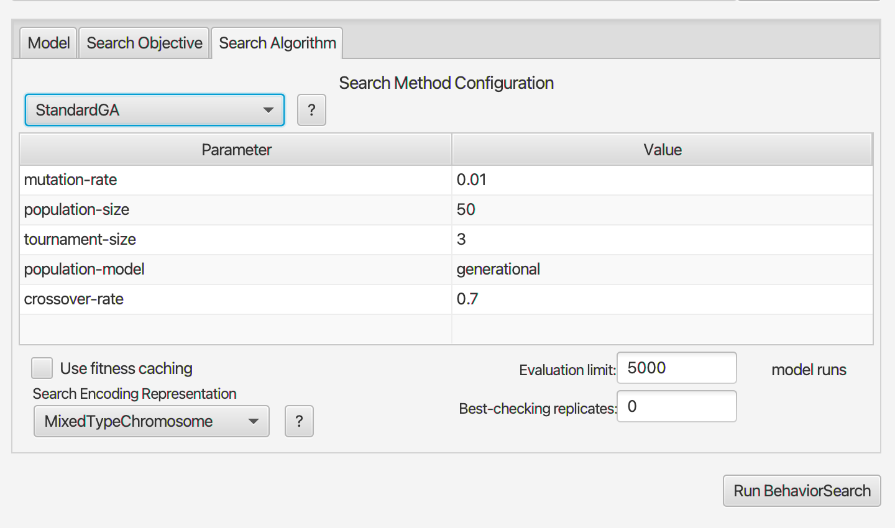
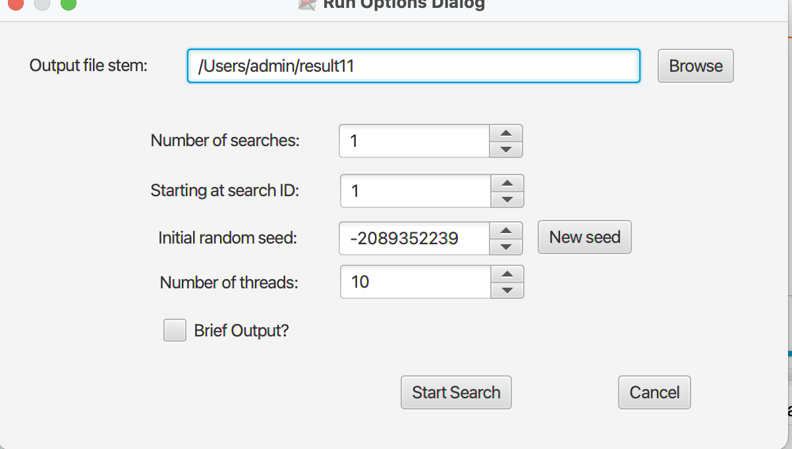
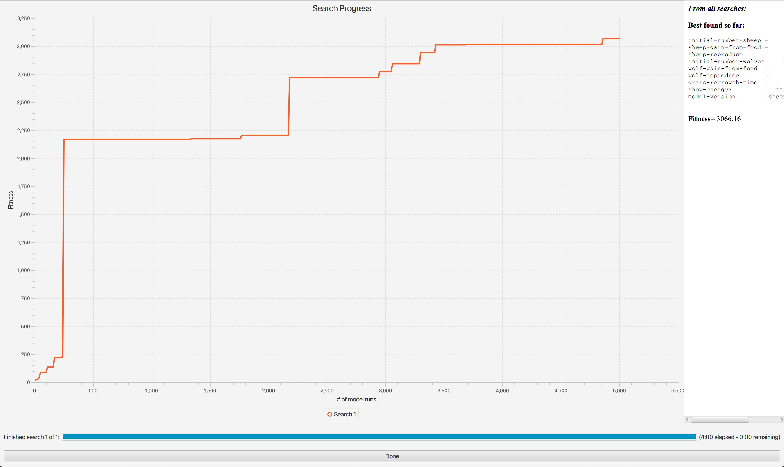
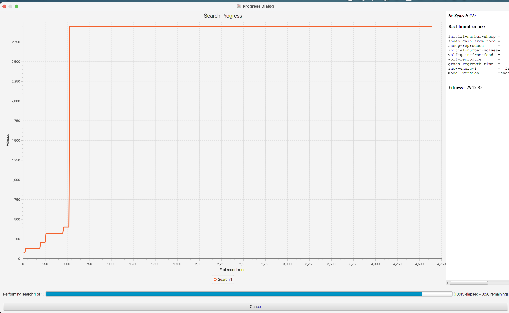
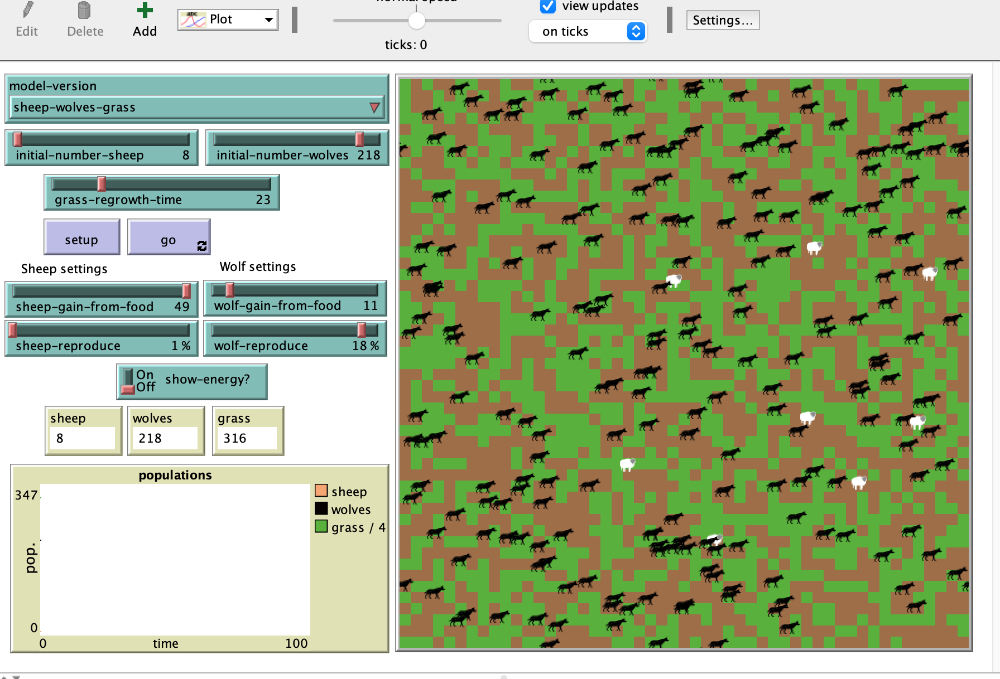
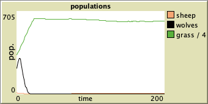

## Комп'ютерні системи імітаційного моделювання
## СПм-22-4, **Жовтоніжко Дмитро Сергійович**
### Лабораторна робота №**3**. Використання засобів обчислювального интелекту для оптимізації імітаційних моделей

 

### Варіант 7, модель у середовищі NetLogo:
[Wolf Sheep Predation](http://www.netlogoweb.org/launch#http://www.netlogoweb.org/assets/modelslib/Sample%20Models/Biology/Wolf%20Sheep%20Predation.nlogo)

 

### Вербальний опис моделі:
Була обрана вдосконалена модель взаємодії вовків-овець з другої лабораторної.

### Керуючі параметри:
- **initial-number-of-sheeps** визначає кількість початкову овець у середовищі моделювання.
- **initial-number-of-wolves** визначає кількість початкову вовків у середовищі моделювання.
- **grass-regrowth-time** час зростання трави у середовищі моделювання.
- **sheep-gain-fr om-food** визначає кількість енергії, що отримує вівця від пожинання трави.
- **wolf-gain-from-food** визначає кількість енергії, що отримує вовк від пожинання вівці.
- **sheep-reproduce** визначає ймовірність розмноження вівці на кожному кроку моделювання.
- **wolf-reproduce** визначає ймовірність розмноження вовка на кожному кроку моделювання.

### Внутрішні параметри:
- **energy**. Енергія тварини у поточний модель часу.
- **max-sheep**. Обмеження максимальної кількості вівець. Це загальний параметр для всіх вівець.
- **countdown**. countdown: Використовується для відліку часу до повторного виростання трави (якщо використовується версія моделі "sheep-wolves-grass").

### Показники роботи системи:
- кількість популяції вовків у поточний момент.
- кількість популяції вівець у поточний момент (не може перевищувати max-sheep) .
- кількість трави у наявності у поточний момент.

 

### Налаштування середовища BehaviorSearch:

**Обрана модель**:
<pre>
/Users/admin/Public/Wolf Sheep Predation.nlogo
</pre>

**Параметри моделі** (вкладка Model):  
<pre>
["initial-number-sheep" [0 1 250]]
["sheep-gain-from-food" [0 1 50]]
["sheep-reproduce" [1 1 20]]
["initial-number-wolves" [0 1 250]]
["wolf-gain-from-food" [0 1 100]]
["wolf-reproduce" [0 1 20]]
["grass-regrowth-time" [0 1 100]]
["show-energy?" true false]
["model-version" "sheep-wolves-grass"] 
</pre>

Нас цікавить дослідження лише у варіанті з травою, тому я прибрав просто sheep-wolves model version.

Використовувана **міра**:  
Для фітнес-функції було обрано **середне значення енергії усіх тварин**, та вказано у параметрі "**Measure**":
<pre>
mean [energy] of turtles
</pre>

Для тестування моделі був обраний період у 0-200 тактів, адже після нього зазвичай залишаються або вовки, або вівці. Цікавим було б максимізувати середню енергію до моменту, коли залишиться хтось один. 
Загальний вигляд вкладки налаштувань параметрів моделі:

Так як ми досліджуємо залежність від кількості тварин, а їх може стати 0, якщо вовки з'їдять усіх овець, то ми робимо mesure if any? turtles.

**Налаштування цільової функції** (вкладка Search Objective):  
Метою підбору параметрів імітаційної моделі, що описує систему полювання вовк-вівця є **максимізація** значення середньої енергії тварин, це вказано у "**Goal**" зі значенням **Maximize Fitness**. Тобто необхідно визначити такі параметри налаштувань моделі, у яких середня енергія є максимальною.
Нас цікавить середнє значення за 200 тактів, тому для цього у параметрі "**Collected measure**", що визначає спосіб обліку значень обраного показника, вказано **MEAN_ACROSS_STEPS**.  
Щоб уникнути викривлення результатів через випадкові значення, що використовуються в логіці самої імітаційної моделі, **кожна симуляція повторюється по 10 разів**, результуюче значення розраховується як середнє арифметичне.
Я вважаю, що випадковість має місце, бо вовки та вівці розмножуються випадково, з певною вирогідністю.
Тому було обрано прогнати симуляцію 10 раз.
Загальний вигляд вкладки налаштувань цільової функції:  

**Налаштування алгоритму пошуку** (вкладка Search Algorithm):  

Загальний вид вкладки налаштувань алгоритму пошуку:  

 

### Результати використання BehaviorSearch:
Діалогове вікно запуску пошуку:

Результат пошуку параметрів імітаційної моделі, використовуючи **генетичний алгоритм**:  

<pre>
Best found so far:

initial-number-sheep =      8
sheep-gain-from-food =     49
sheep-reproduce      =      0
initial-number-wolves=    218
wolf-gain-from-food  =     11
wolf-reproduce       =     18
grass-regrowth-time  =     23
show-energy?         =  false
model-version        =sheep-wolves-grass

Fitness= 3066.16
</pre>
Результат пошуку параметрів імітаційної моделі, використовуючи **випадковий пошук**:
<pre>
Best found so far:

initial-number-sheep =    243
sheep-gain-from-food =     42
sheep-reproduce      =      0
initial-number-wolves=    220
wolf-gain-from-food  =      3
wolf-reproduce       =     15
grass-regrowth-time  =      5
show-energy?         =  false
model-version        = sheep-wolves-grass

Fitness= 2945.85
</pre>

Підставимо отримані дані у модель:

Отримали цікавий результат: вовки досить швидко вимирають, а вівці не розмножуються.

Деякий час у нас бігає 7-20 овець. Їжі їм вистачає, вовки швидко вимерли, тож графік виглядає логічним, бо якщо є лише декілька овець, яким завжди вистачає їжі, то середнє значення енергії буде високим.

